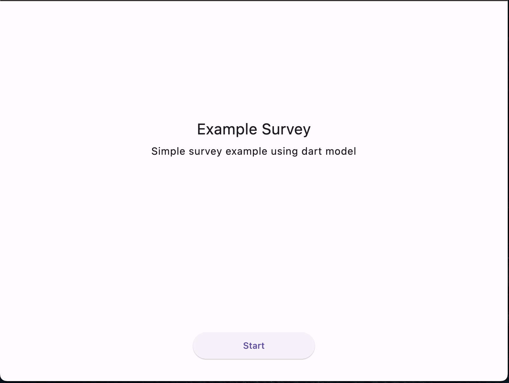
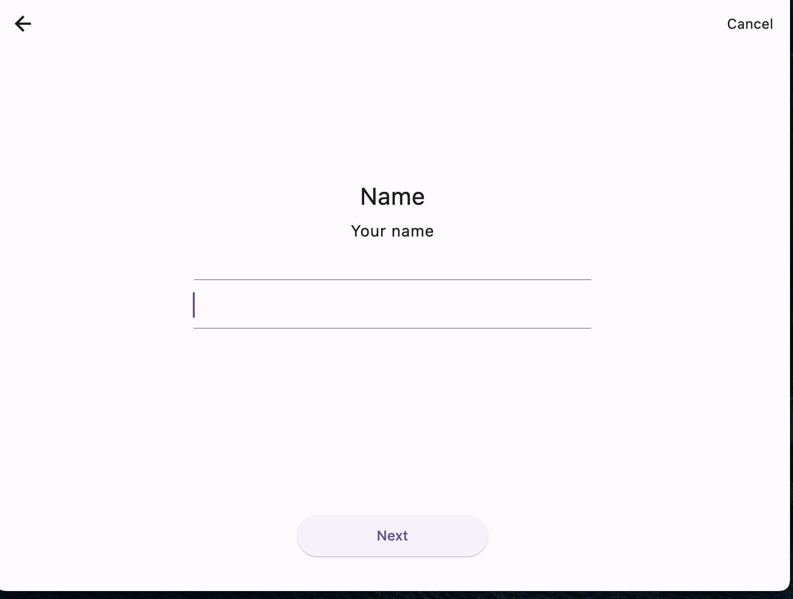
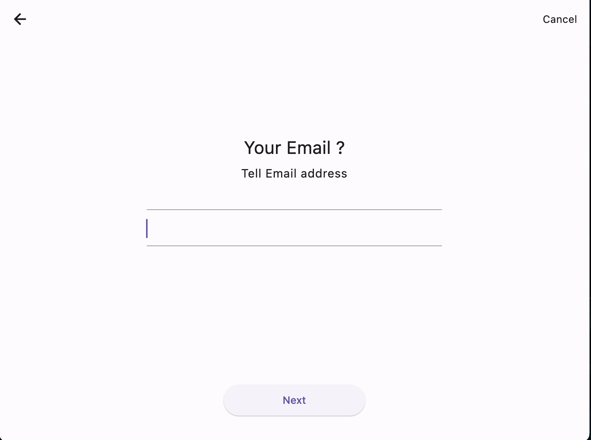
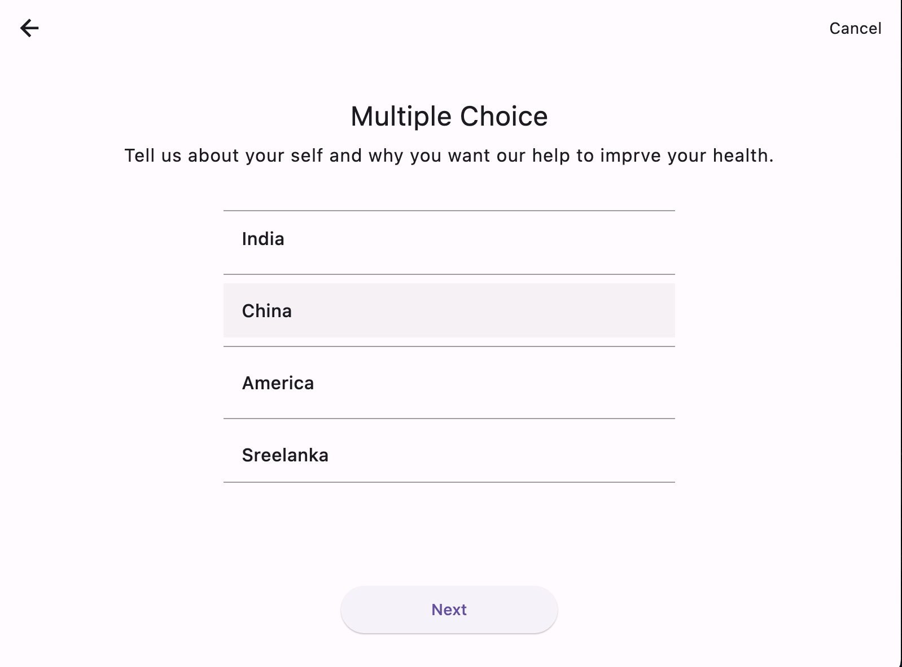
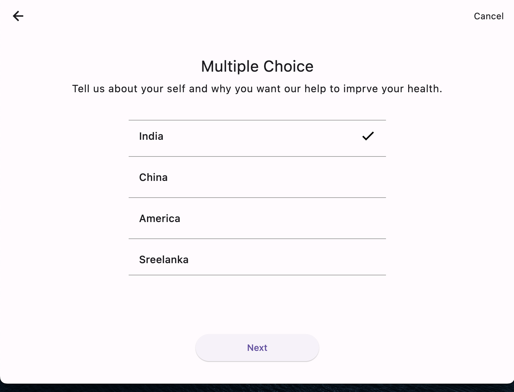
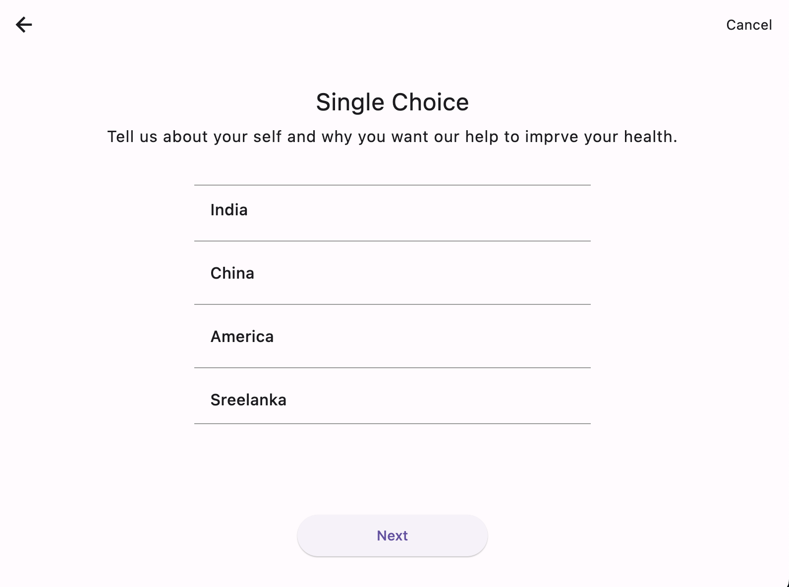
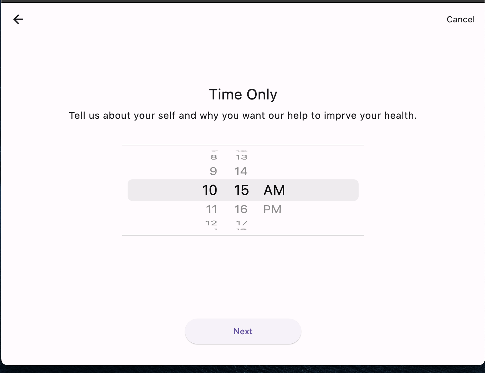
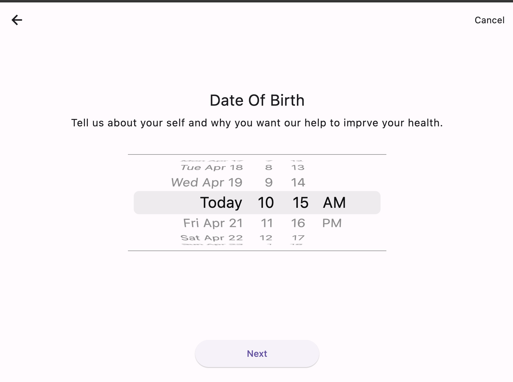
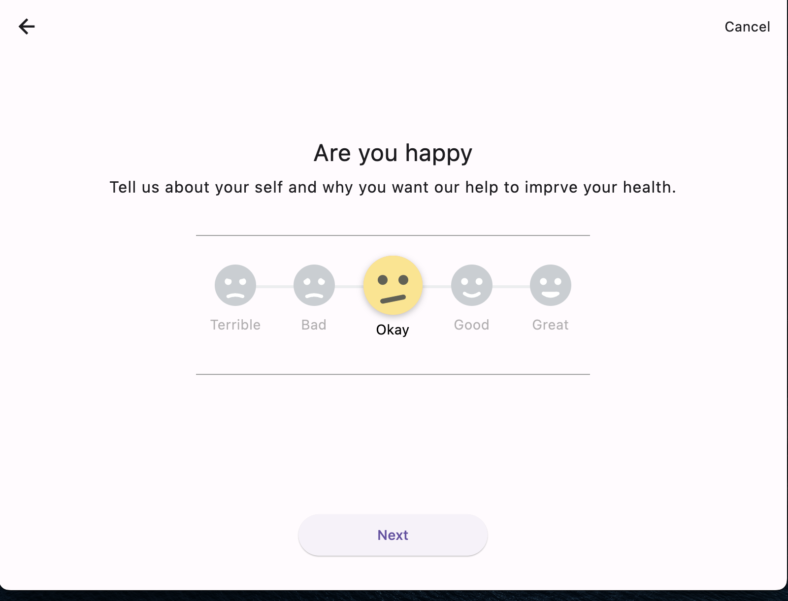
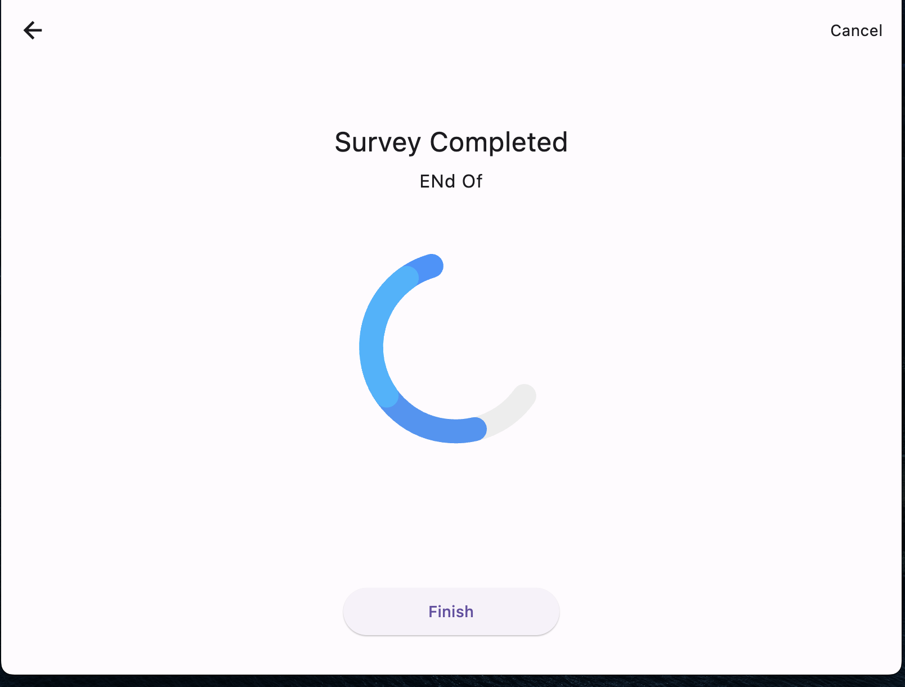

# FormStack

FormStack is a library designed to help developers create dynamic user interfaces in Flutter. Specifically, the library is focused on creating forms and surveys using a JSON or Dart language model.

The primary goal of FormStack is to make it easy for developers to create dynamic UIs without having to write a lot of code. By using a JSON or Dart model to define the structure of a form or survey, developers can quickly create UIs that are easy to customize and update.

While the library was initially created to help developers create survey UIs, the focus has expanded to include any type of dynamic application UI. With FormStack, developers can create UIs that are responsive and adaptable to different devices and screen sizes.

Overall, FormStack is a powerful tool for creating dynamic user interfaces in Flutter. It offers a flexible and customizable approach to UI design, allowing developers to create UIs that are easy to use and maintain.

## Dart Versions

- Dart >=2.19.6 < 3.0.0

## Examples

- [Simple Example](https://github.com/sudhi001/FormStack/tree/main/example) - an example of how to create a UI using FormStack.

## Screenshots

